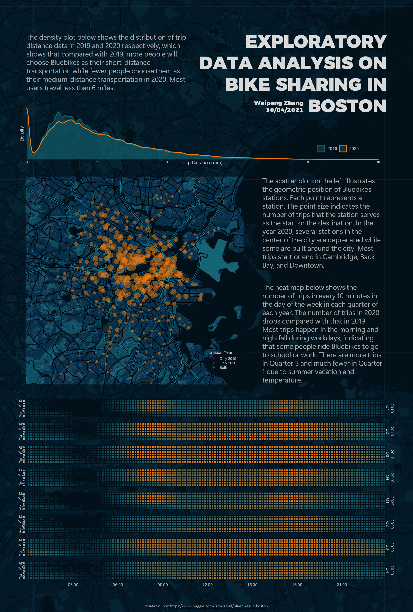

# Exploratory Data Analysis on Bike Sharing in Boston

Author: Weipeng Zhang

- `mini-poster.ipynb` is the R source file for producing the plots used in the poster.
- `Mini-poster.png` is the high-resolution version of the poster.

